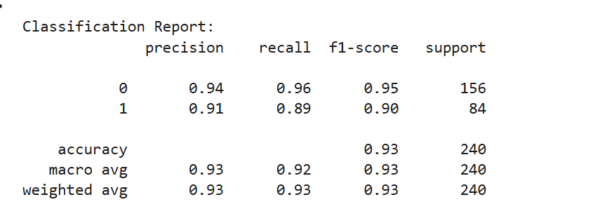
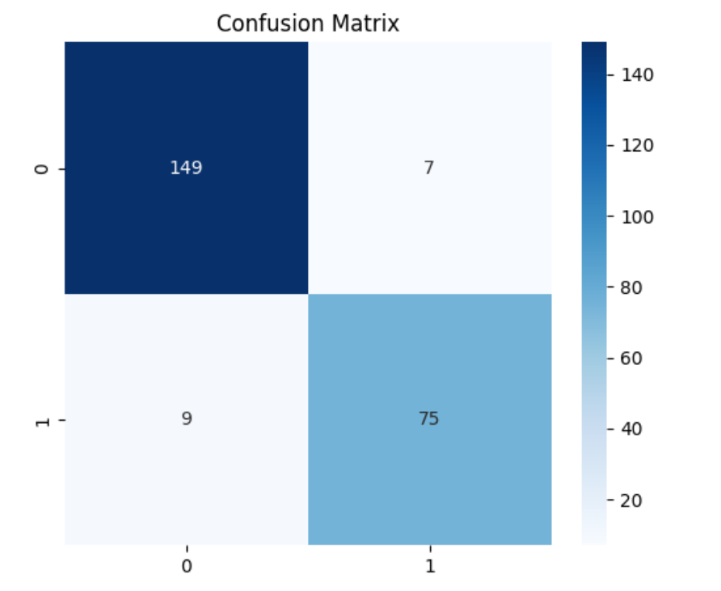
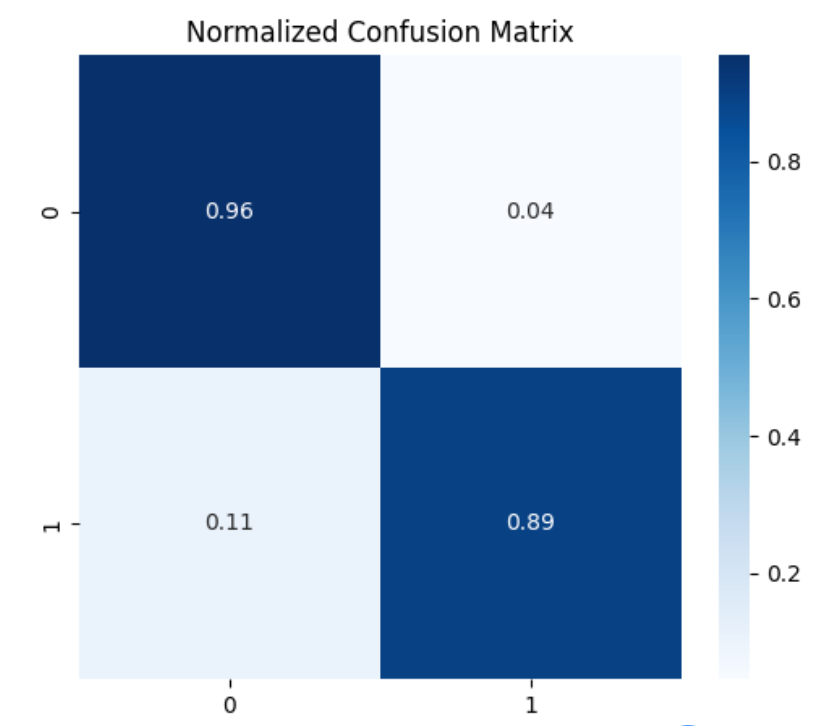
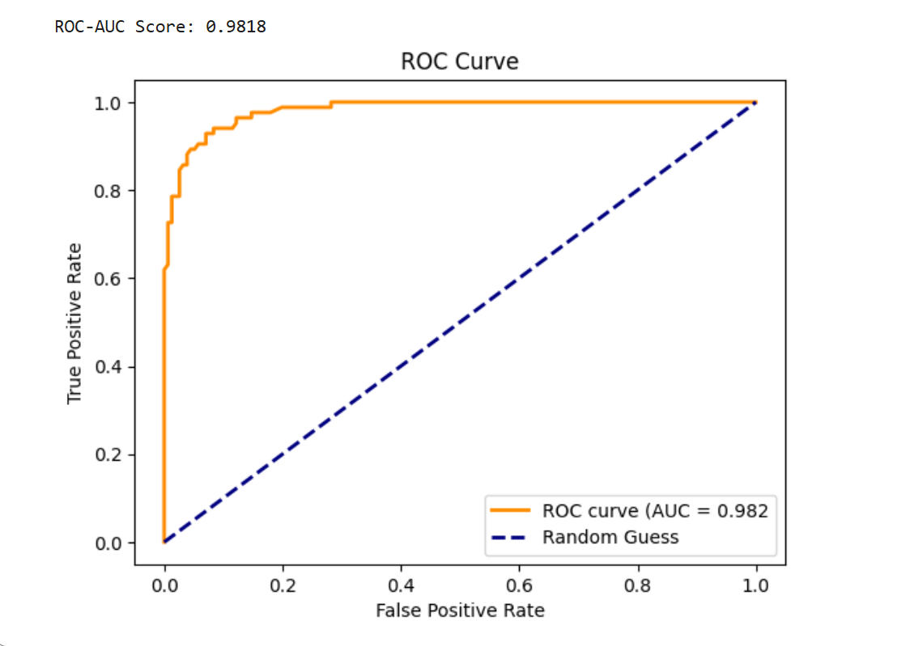
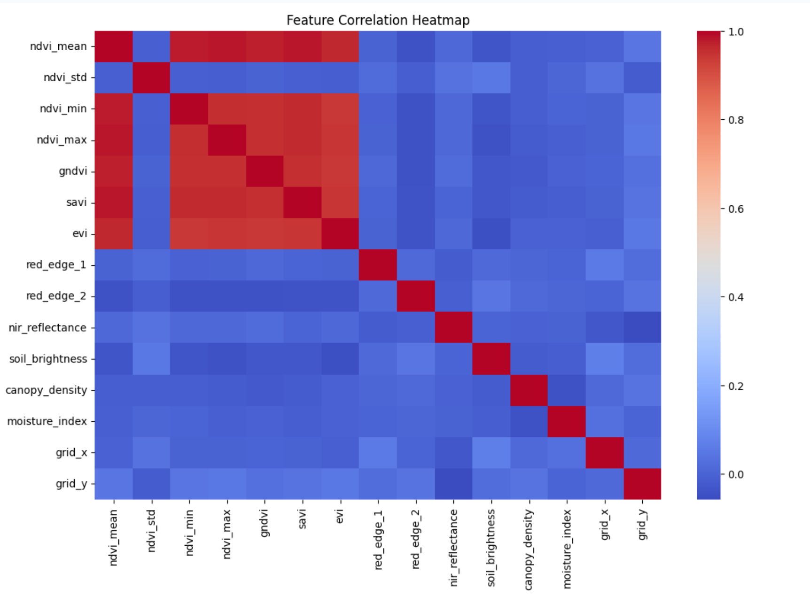
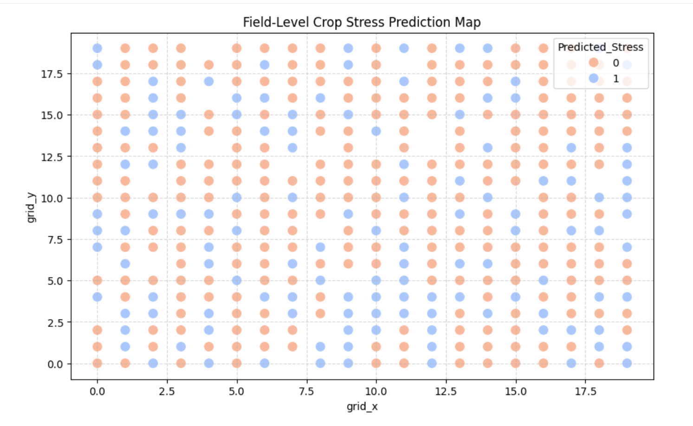
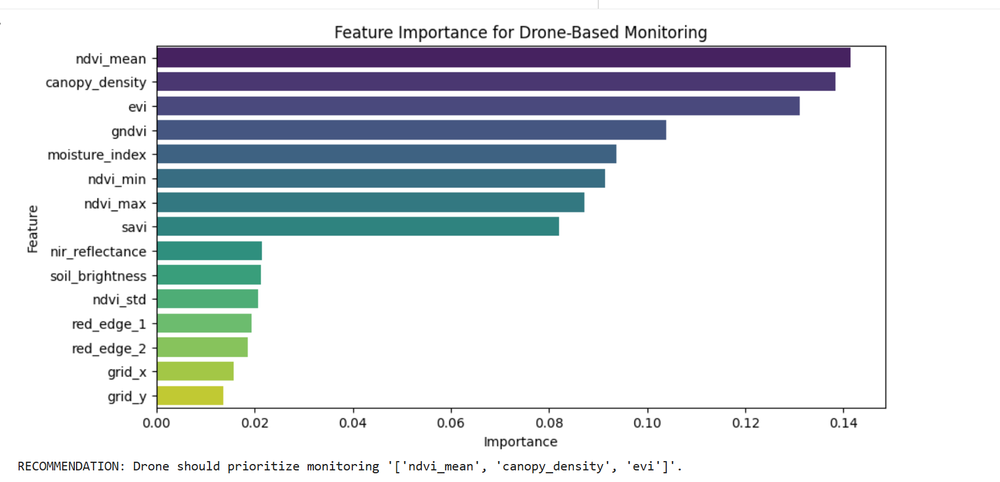

# 🌾 AI-Based Crop Health Detection

Machine Learning project for crop health prediction using drone-based multispectral agricultural data and vegetation indices.

---

# 📌 Project Overview

This project uses drone-based multispectral agricultural data and machine learning techniques to predict crop health conditions. The objective is to help farmers identify crop stress early using vegetation indices and remote sensing features.

The project applies a Random Forest Classifier for crop health classification and includes data preprocessing, exploratory data analysis (EDA), feature importance analysis, spatial crop stress visualization, and model evaluation.

---

# 🚀 Real-World Applications

- Precision agriculture and smart farming
- Early crop stress and disease detection
- Drone-assisted agricultural monitoring
- Yield optimization and resource management
- Data-driven farming decisions
- Remote crop health assessment using multispectral imagery

---

# 🛠 Technologies Used

- Python
- Pandas
- NumPy
- Matplotlib
- Seaborn
- Scikit-learn
- Jupyter Notebook / Google Colab

---

# 📂 Dataset Information

The dataset contains multispectral agricultural and vegetation index features collected for crop health monitoring.

### Features Used

- NDVI Mean
- NDVI Standard Deviation
- NDVI Min / Max
- GNDVI
- SAVI
- EVI
- Red Edge Features
- NIR Reflectance
- Soil Brightness
- Canopy Density
- Moisture Index
- Grid Coordinates

---

# ⚙️ Machine Learning Workflow

1. Data Collection & Understanding
2. Data Preprocessing
3. Exploratory Data Analysis (EDA)
4. Feature Engineering
5. Train-Test Split
6. Random Forest Model Training
7. Model Evaluation
8. Feature Importance Analysis
9. Spatial Crop Stress Visualization

---

# 🤖 Why Random Forest?

Random Forest was selected because it performs well on structured tabular datasets, handles feature interactions effectively, reduces overfitting risk, and provides feature importance analysis.

---

# 📊 Model Performance

### Classification Report



---

### Confusion Matrix



---

### Normalized Confusion Matrix



---

### ROC Curve



---

# 📈 Exploratory Data Analysis

### Correlation Heatmap



---

# 🌍 Spatial Crop Stress Visualization

### Field-Level Crop Stress Prediction Map



---

# 📌 Feature Importance Analysis



---

# 📁 Project Structure

```bash
AI-Based-Crop-Health-Detection/
│
├── notebooks/
│   └── crop_health_detection.ipynb
│
├── screenshots/
│
├── data/
│   └── dataset_link.txt
│
├── requirements.txt
├── README.md
├── LICENSE
└── .gitignore
```

---

# 🔮 Future Improvements

- Deep learning-based crop classification
- Real-time drone monitoring integration
- Disease-specific crop analysis
- Deployment using Streamlit or Flask
- Satellite imagery integration
- IoT-based smart agriculture system

---

# 👨‍💻 Author

**Vikash Yadav**  
AI/ML Enthusiast | Python Developer | Drone Technology Learner

GitHub: https://github.com/vikuyaduvanshi16

---

# 📜 License

This project is licensed under the MIT License.